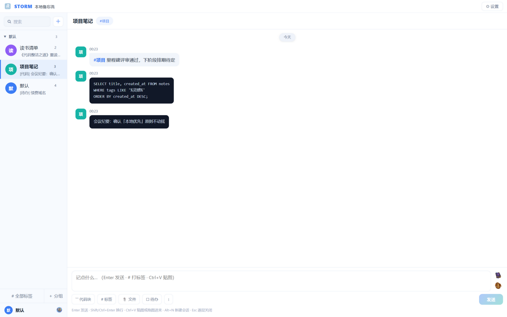
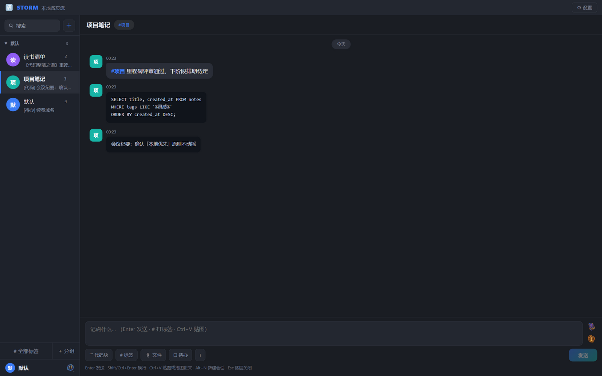
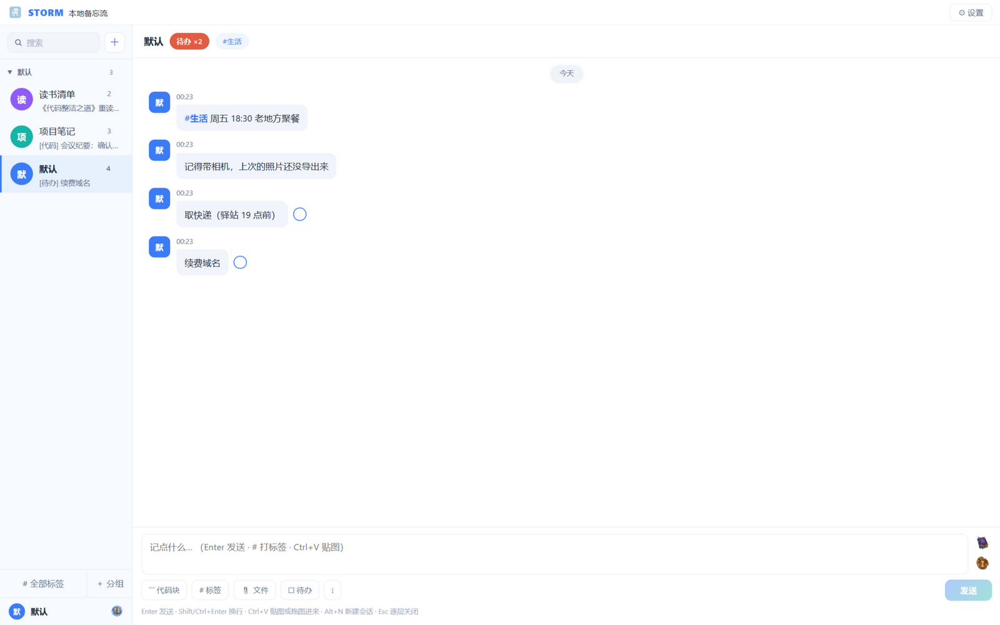

# STORM 本地备忘流

**像聊天一样记录 —— 数据 100% 存在你自己的电脑里**

零账号 · 纯离线 · 无网络请求 · 数据即文件

 

<h3><a href="https://github.com/lw-storm/STORM-TIME/releases/latest">⬇️ 下载最新版（Windows）</a></h3>

安装版一路「下一步」 · 便携版解压即用 · <a href="docs/STORM-User-Manual-CN.pdf">使用说明书（PDF）</a>

---

## 这是什么

STORM 是一款 **本地优先** 的桌面备忘应用。界面形似熟悉的聊天软件——左侧会话列表、右侧消息时间轴，让「记事」拥有「聊天」般的轻快：打开即聚焦输入框，打字、回车，一条记录就完成了。

与常见的云笔记不同，STORM **不依赖任何服务器**：所有数据（备忘、图片、文件、头像、壁纸）以真实文件的形式存放在**你自己选择的数据文件夹**中，可以在资源管理器里直接查看、拷贝与备份。应用全程无网络请求、无统计上报，卸载后不残留任何个人数据。

## 特性

| | |
|---|---|
| **五种记录类型** | 文本、代码块、图片、文件、待办——一条输入框全部覆盖 |
| **QQ 式会话** | 多会话隔离不同主题；最近使用排序；分组折叠管理 |
| **标签与检索** | `#` 开头自动打标签；会话内多条件检索＋全库即时搜索 |
| **待办追踪** | 待办可打勾完成；会话顶部汇总提示一键定位 |
| **时空回溯** | 把记录写进过去——整理旧资料、归档聊天记录时按原始日期入库 |
| **悬浮窗速记** | 手机形态小窗常驻桌面，`Alt+S` 三秒记录（按→打字→回车） |
| **文件即数据** | 文件以真实名字落盘；双击卡片用系统程序打开真身；版本顶替自动归档 |
| **本地备份** | 一键导出 zip 备份包；导入按 ID 智能合并；可配置自动备份 |
| **多身份工作区** | 每个身份一套完全独立的数据世界，工作与生活互不干扰 |
| **外观系统** | 主题色、深浅模式、气泡与字号独立可调，5 套一键模板 |

## 界面

悬浮窗（手机形态）

## 下载

前往 [**Releases**](https://github.com/lw-storm/STORM-TIME/releases/latest) 页面：

- **安装版**（`STORM-vX.X.X-setup.exe`）——双击一路「下一步」，推荐
- **便携版**（`STORM-vX.X.X-portable.zip`）——解压到任意目录双击即用，卸载＝删除目录

直链下载（Releases 页加载缓慢时用）：

- [STORM-v3.1.0-setup.exe](https://github.com/lw-storm/STORM-TIME/releases/download/v3.1.0/STORM-v3.1.0-setup.exe)
- [STORM-v3.1.0-portable.zip](https://github.com/lw-storm/STORM-TIME/releases/download/v3.1.0/STORM-v3.1.0-portable.zip)

> 需要 Windows 10 / 11。应用基于系统自带的 WebView2 运行时（多数电脑已预装；安装版检测到缺失会自动补装）。

## 快速上手

1. 首次启动：选择一个文件夹作为**数据目录**（建议新建一个专用空文件夹）
2. 输入框打字，`Enter` 发送——第一条记录就完成了
3. 更多功能见 [使用说明书](docs/STORM-User-Manual-CN.pdf)

**常用快捷键**

| 快捷键 | 作用 |
|---|---|
| `Enter` / `Shift+Enter` | 发送 / 换行 |
| `Ctrl+K` | 聚焦全局搜索 |
| `Alt+N` | 新建会话 |
| `Alt+S` | 唤出/收起悬浮窗（全局生效） |
| `Esc` | 逐层退出 |

## 数据安全

- **数据不出本机**：全程无网络请求、无账号、无统计上报
- **数据即文件**：数据文件夹布局与备份包同构（`data.json` ＋ `images/` ＋ `files/` ＋ `avatar/` ＋ `walls/`），任何编辑器可读，随时可迁移
- **快照写入**：改动后防抖落盘，`.bak` 镜像防损坏
- **清空需双重确认**，且执行前自动触发一次全量备份

## 关于本仓库

本仓库为 **发布仓库**：用于分发安装包、对外说明书与产品介绍。应用源码暂不公开，后续视迭代情况再定。

- 问题反馈 / 功能建议：欢迎开 [Issue](https://github.com/lw-storm/STORM-TIME/issues)
- 版权：© 2026 STORM. 保留所有权利。

---

数据只属于你。

