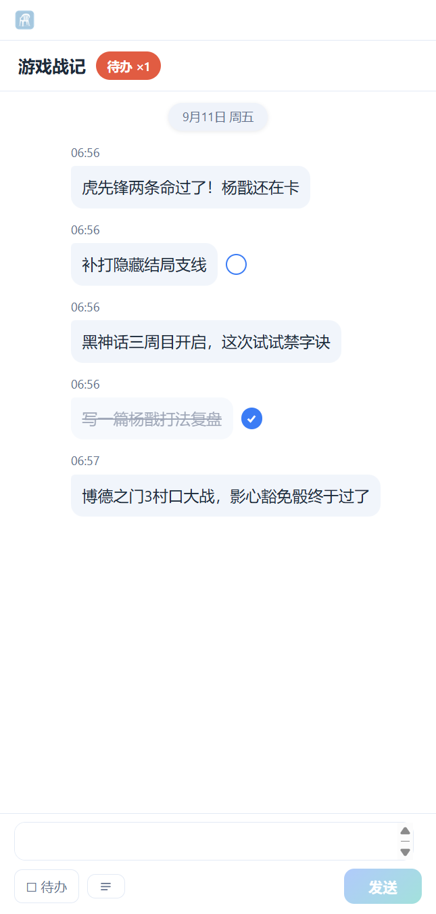
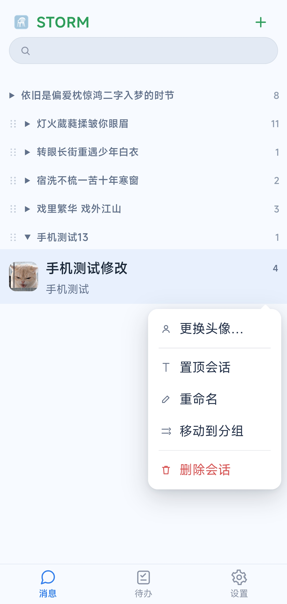
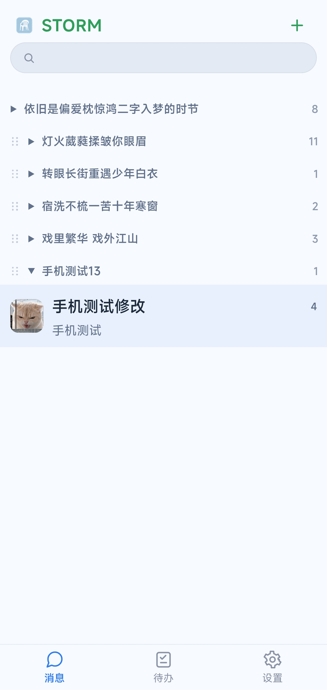

# STORM 本地备忘流

**像聊天一样记录**

零账号 · 纯离线 · 无网络请求 · 数据即文件

[下载最新版](https://github.com/lw-storm/STORM-TIME/releases/latest) · [使用说明书](docs/STORM-User-Manual-CN.pdf)

---

## 夹在AI专业术语中的碎碎念

就是为什么我想要一个 有时间轴的备忘录 而不是那种直接写文本的备忘录
时间是能承载记忆和灵魂的
比如说 打黑神话的时候，打哪个boss死了多少次随时记一记（我虎先锋两条命就过了）打博德之门 时候村口大战记一记、月光塔记一记、遇到博德安记一记  打P5R时候解锁了哪个同伴：芳泽、高卷、穷哥们、佐仓千叶等等等等 下次回头看时候 很清晰看到是哪天哪个日期 游戏里做到了这一步
平常百无聊赖的过程中 随机迸发的碎碎念，可以分好类 扣上时间烙印留存下来
想看没看的电影 想看没看得书 想打没打的游戏 都可以分散记录 好好留存下来

聊天记录是天然的版本快照与时间戳 人生需要记录，而且需要带时间戳的记录

为此特地开发了时空回溯模式 “If I could see time in a bottle” 可以以过去的时间戳发消息，把想留下来老消息保留过去的时间戳

我希望有一个工具能来承载 碎片化的灵魂 并捡拾散落于光年之外的回忆

## 这是什么

STORM 是一款 **本地优先** 的桌面备忘应用。界面形似熟悉的聊天软件——左侧会话列表、右侧消息时间轴，让「记事」拥有「聊天」般的轻快：打开即聚焦输入框，打字、回车，一条记录就完成了。

与常见的云笔记不同，STORM **不依赖任何服务器**：所有数据（备忘、图片、文件、头像、壁纸）以真实文件的形式存放在**你自己选择的数据文件夹**中，可以在资源管理器里直接查看、拷贝与备份。应用全程无网络请求、无统计上报，卸载后不残留任何个人数据。

## 特性

| | |
|---|---|
| **五种记录类型** | 文本、代码块、图片、文件、待办——一条输入框全部覆盖 |
| **聊天 式会话** | 多会话隔离不同主题；最近使用排序；分组折叠管理 |
| **标签与检索** | `#` 开头自动打标签；会话内多条件检索＋全库即时搜索 |
| **待办追踪** | 待办可打勾完成；会话顶部汇总提示一键定位；普通消息与待办一键互转 |
| **时空回溯** | 把记录写进过去——整理旧资料、归档聊天记录时按原始日期入库 |
| **悬浮窗速记** | 手机形态小窗常驻桌面，`Alt+S` 三秒记录（按→打字→回车） |
| **安卓手机端** | 扫码配对一次，手机独立可用——会话与分组管理、会话内检索、头像设置，自动同步、离线可写 |
| **静默同步** | 手机与电脑互传悄无声息——翻看历史时新消息不打断阅读，列表不跳动；回到底部自动追新 |
| **文件即数据** | 文件以真实名字落盘；双击卡片用系统程序打开真身；版本顶替自动归档 |
| **本地备份** | 一键导出 zip 备份包；导入按 ID 智能合并；可配置自动备份 |
| **多身份工作区** | 每个身份一套完全独立的数据世界，工作与生活互不干扰 |
| **外观系统** | 主题色、深浅模式、气泡与字号独立可调，5 套一键模板 |

## 界面

悬浮窗（手机形态）

安卓手机端

手机端是电脑 STORM 的**随身镜像**：同一 Wi-Fi 下扫码配对一次，手机上即可查看全部消息、会话、分组与外观（壁纸头像自动同步），也能随手记文字、待办、拍照上传；**离线也能记**，连网自动补发。

底部三标签页（消息 / 待办 / 设置），微信式逐层返回；手机上做的记录，电脑开着就实时出现。数据主权在电脑——删除手机应用不动电脑任何数据。

**管理也上了手机**：长按会话即可置顶、重命名、移动分组、更换头像、删除；分组支持新建、改名、拖动排序，与电脑**双向同步**；进对话点台风图标——关键词＋类型＋日期检索，点结果直达那条消息。

<table><tr>
<td></td>
<td></td>
<td></td>
</tr></table>

**个性化**：设置 → 个性化——外观模板一键换装、主题色、暗色界面、气泡配色与壁纸，手机上的修改与电脑双向同步，两端保持一致。

**看图**：点任意图片进入全屏查看——左右滑动切换同会话图片、双指缩放、双击放大；操作条「保存」可存入手机相册。

**换头像**：长按会话 → 更换头像，全屏裁剪——拖动取景、捏合缩放，手机换完电脑立即更新。

## 下载

前往 [**Releases**](https://github.com/lw-storm/STORM-TIME/releases/latest) 页面：

- **安装版**（`STORM-setup.exe`）——双击一路「下一步」，推荐
- **便携版**（`STORM-portable.zip`）——解压到任意目录双击即用，卸载＝删除目录
- **安卓版**（`STORM-android.apk`）——手机安装，与电脑端在同一 Wi-Fi 下扫码配对即用

> 手机与电脑须在同一 Wi-Fi / 局域网；同步走自家加密通道，无公网传输。

> 需要 Windows 10 / 11。应用基于系统自带的 WebView2 运行时（多数电脑已预装；安装版检测到缺失会自动补装）。

## 快速上手

1. 首次启动：选择一个文件夹作为**数据目录**（建议新建一个专用空文件夹）
2. 输入框打字，`Enter` 发送——第一条记录就完成了
3. 更多功能见 [使用说明书](docs/STORM-User-Manual-CN.pdf)

**常用快捷键**

| 快捷键 | 作用 |
|---|---|
| `Enter` / `Shift+Enter` | 发送 / 换行 |
| `Ctrl+K` | 聚焦全局搜索 |
| `Alt+N` | 新建会话 |
| `Alt+S` | 唤出/收起悬浮窗（全局生效） |
| `Esc` | 逐层退出 |

## 数据安全

- **数据不出本机**：全程无网络请求、无账号、无统计上报
- **数据即文件**：数据文件夹布局与备份包同构（`data.json` ＋ `images/` ＋ `files/` ＋ `avatar/` ＋ `walls/`），任何编辑器可读，随时可迁移
- **快照写入**：改动后防抖落盘，`.bak` 镜像防损坏
- **清空需双重确认**，且执行前自动触发一次全量备份
- **手机配对同步走自家局域网加密通道**（带证书校验），无账号、无云、无公网传输

## 关于本仓库

本仓库为 **发布仓库**：用于分发安装包、对外说明书与产品介绍。因功能仍在迭代，应用源码暂不公开，希望各位朋友能多提提issue。

- 问题反馈 / 功能建议：欢迎开 [Issue](https://github.com/lw-storm/STORM-TIME/issues)
- 版权：© 2026 STORM. 保留所有权利。

---

